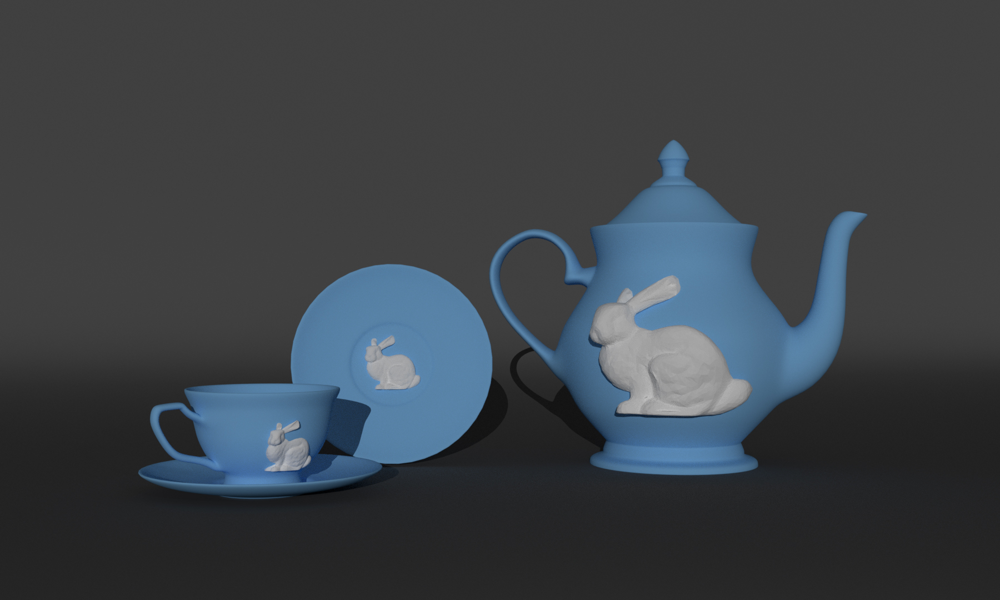

# Bas-Relief from 3D Models

An implementation for the paper [Apperance Mimicking Surfaces](https://cims.nyu.edu/gcl/papers/mimicking-2014.pdf) by C. Shüller, D. Panozzo and O. Sorkine-Hornung. The paper proposes a way to reduce the 3D model to a shallow relief, while keeping its light reflections from the model to be as close as possible to the original 3D model. 

Because light reflections are determined by angle between incoming light and the normal vector of the surface, if we can re-parameterize the surface normals of the mesh by the vertex positions, then we can optimize for these vertex positions to make the lighting effect to be as close as possible to the original mesh, given the restricted relief depth.

### Renderings for the generated bas-relief:

